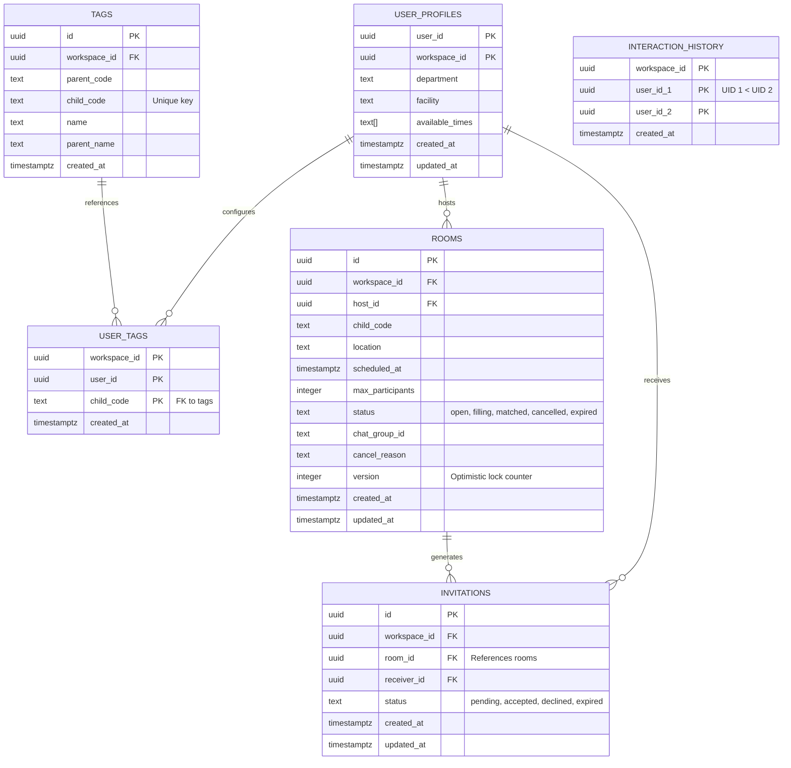

# TÀI LIỆU YÊU CẦU SẢN PHẨM (PRD) — BUDDY CONNECT

Dự án **Buddy Connect** (hay **Mushy Connect**) là một ứng dụng nhỏ (Mini-App) chạy bên trong hệ sinh thái **Mushy Super App**. Ứng dụng được thiết kế nhằm mục đích thúc đẩy văn hóa gắn kết nội bộ, kết nối chéo giữa các nhân viên trong cùng một tổ chức hoặc liên kết giữa các doanh nghiệp (Workspace) thông qua sở thích cá nhân, hoạt động thể thao và giao lưu ăn uống.

---

## 1. Tổng quan hệ thống & Kiến trúc (Tech Stack)

### 1.1 Khung công nghệ lõi
*   **Frontend**: React 18, Vite, Vanilla CSS (kết hợp các token tối ưu hóa giao diện và trải nghiệm di động của hệ sinh thái Mushy).
*   **Database**: Supabase PostgreSQL (phân tách tự động hai schema: `app_buddy_connect` cho Production và `app_buddy_connect_dev` cho sandbox Development/Preview).
*   **Realtime**: Đăng ký cơ chế logical replication phát hành sự kiện WAL thông qua Pub/Sub của Supabase Realtime (với replica identity đặt ở mức `FULL` trên các bảng cần truyền phát dữ liệu).
*   **Native JS Bridge**: Kết nối trực tiếp với ứng dụng gốc (Native Shell) qua giao thức `postMessage` (Bridge) để thực thi các tác vụ phần cứng hoặc tác vụ tích hợp của hệ điều hành.

### 1.2 Quy ước bố cục mã nguồn
```
buddy-connect/
├── mushy.config.json         ← Cấu hình thông tin kết nối Supabase và slug định danh
├── src/
│   ├── App.jsx               ← Điều phối logic toàn bộ luồng giao diện (4 tab chính)
│   ├── App.css               ← Định nghĩa style trang trí, hiệu ứng chuyển động gradient
│   ├── main.jsx              ← Wrap ứng dụng vào DialogProvider và khởi chạy theme
│   ├── components/
│   │   ├── Dialog.jsx        ← Trình bao bọc hộp thoại useDialog() thay cho alert/confirm native
│   │   ├── Select.jsx        ← Trình chọn dropdown tùy biến hỗ trợ Sticky Search & Keyboard Nav
│   │   └── ScopeSwitcher.jsx ← Hộp chọn chuyển đổi Workspace phục vụ liên kết chia sẻ dữ liệu
│   └── lib/                  ← Bộ công cụ lõi kết nối Supabase, chia sẻ chéo, native bridge...
├── api/                      ← Serverless Functions chạy server-side (proxy AI, xác thực JWT)
├── migrations/               ← Các file SQL tạo cấu trúc bảng và thiết lập chính sách bảo mật RLS
```

---

## 2. Đặc tả tính năng chi tiết (Core Feature Specifications)

Ứng dụng chia làm 4 phân hệ chính hiển thị dưới dạng thanh điều hướng Tab-Navigation phía dưới màn hình:

### Phân hệ 1: Radar Kết Nối (Tab Radar)
Tính năng tìm kiếm và đề xuất đồng nghiệp có độ khớp cao nhất về sở thích để rủ lập kèo giao lưu.

*   **Bộ lọc danh sách**: Quét toàn bộ nhân viên thuộc Workspace đang hoạt động (active scope).
*   **Công thức tính toán Tỷ lệ trùng khớp (Match Score)**:
    *   Điểm cơ bản: `30%`.
    *   Mỗi thẻ sở thích trùng lặp hoàn toàn (exact child tag match): cộng thêm `25%`.
    *   Mỗi nhóm danh mục sở thích cha trùng lặp (parent group match): cộng thêm `10%`.
    *   Làm việc tại cùng một cơ sở vật lý (facility): cộng thêm `15%`.
    *   Giới hạn trần điểm hiển thị: Tối đa `99%` (để tạo cảm giác chân thực).
*   **Thuật toán xếp hạng ưu tiên (Priority Levels)**:
    *   **Mức 1 (Ưu tiên cao nhất — Mức 1)**: Trùng ít nhất 1 thẻ sở thích con **VÀ** khác phòng ban (Department) **VÀ** chưa từng tương tác (giúp tối ưu kết nối chéo).
    *   **Mức 2 (Mức 2)**: Trùng thẻ sở thích con **VÀ** cùng phòng ban **VÀ** chưa từng tương tác.
    *   **Mức 3 (Mức 3)**: Khác sở thích con, gợi ý chéo dựa trên bộ môn cùng danh mục cha (Trigger Controlled Fallback). Người dùng có thể tắt/bật tính năng gợi ý chéo này thông qua checkbox trên giao diện.
*   **Tương tác chéo**: Hiển thị thẻ thông tin định dạng cao cấp (Buddy Card) kèm các nút:
    *   *Rủ lập kèo Connect*: Mở form tạo phòng hẹn và tự động điền sẵn bộ môn của người được rủ làm mặc định.
    *   *Gọi điện*: Thực thi lệnh gọi thông qua Native Bridge (`bridge.tel`).

---

### Phân hệ 2: Quản lý Phòng Hẹn (Tab Rooms)
Không gian tự lập hoặc tham gia các phòng đi chơi, ăn uống, thi đấu thể thao.

*   **Ràng buộc tạo phòng (Co-creation Constraint)**:
    Để tránh việc tạo "phòng mồ côi", hệ thống bắt buộc Host khi khởi tạo phòng phải chọn gửi lời mời đầu tiên đến **ít nhất 1 người đồng nghiệp** trong danh sách thành viên khả dụng thì mới cho phép tạo phòng.
*   **Tránh đụng độ lịch trình (Schedule Clash Prevention)**:
    Khi Host tạo phòng hoặc Guest chấp nhận lời mời, hệ thống sẽ kiểm tra xung đột thời gian (Safety window = `1.5 giờ`). Nếu Host/Guest đã tham gia hoặc đang làm Host ở một phòng hẹn khác trong khoảng thời gian $\pm 1.5$ giờ đó, hệ thống sẽ phát cảnh báo:
    *   Nếu là Host tạo phòng: Cho phép xác nhận tạo bù (cho phép trùng lịch nếu cần).
    *   Nếu là Guest chấp nhận lời mời: Đưa ra tùy chọn cho phép **tự động rút khỏi phòng cũ** (Declined hoặc Cancelled tùy vai trò ở phòng cũ) để gia nhập phòng mới.
*   **Hạn ngạch phát lời mời (Outbound Rate Quota)**:
    Để tránh tình trạng Host gửi lời mời spam vô tội vạ, hệ thống áp dụng công thức giới hạn số lượng lời mời đang ở trạng thái chờ (Pending):
    $$\text{Giới hạn số lời mời pending} = (\text{Sĩ số tối đa của phòng} - \text{Số người thực tế đã tham gia}) \times 3$$
    Host bắt buộc phải thu hồi (Revoke) các lời mời cũ không nhận phản hồi để có thể tiếp tục mời người mới.
*   **Cơ chế chống tranh chấp slot (Optimistic Locking)**:
    Khi một phòng hẹn ở trạng thái `open` hoặc `filling`, nếu có nhiều Guest cùng lúc bấm chấp nhận lời mời tham gia, hệ thống sẽ sử dụng cơ chế khóa lạc quan tăng cột `version` của bảng `rooms` lên $1$. Phiên giao dịch nào chạy nhanh nhất sẽ lấy được slot, các phiên giao dịch muộn hơn sẽ bị hủy và báo lỗi "Tranh chấp slot" để đảm bảo phòng không bị vượt quá sĩ số tối đa (`max_participants`).
*   **Tự động dọn dẹp các kèo hết hạn (Client-side Lazy Daemon)**:
    Mỗi khi người dùng mở ứng dụng, một luồng chạy ngầm (Lazy Sweep Daemon) sẽ quét các phòng hẹn có thời gian diễn ra (`scheduled_at`) nhỏ hơn thời điểm hiện tại nhưng vẫn ở trạng thái `open` hoặc `filling` để tự động chuyển trạng thái của phòng hẹn đó và các lời mời liên quan sang trạng thái hết hạn (`expired`).
*   **Đóng phòng hẹn & Hủy kèo văn minh (Host Withdrawal with reasons)**:
    Host có quyền đóng hoặc hủy phòng hẹn bất cứ lúc nào. Hệ thống bắt buộc Host phải nhập hoặc chọn một lý do hủy phòng (Ví dụ: bận việc đột xuất, thời tiết xấu...). Khi xác nhận hủy:
    1.  Trạng thái phòng hẹn chuyển sang `cancelled` kèm lý do.
    2.  Hệ thống gửi một thông báo văn minh kèm lý do hủy phòng vào nhóm chat.
    3.  Tự động chuyển nhóm chat sang trạng thái chỉ đọc (Read-only) bằng Native Bridge để giải tán nhóm văn minh.

---

### Phân hệ 3: Hộp Thư Lời Mời (Tab Inbox)
Nơi hiển thị các lời mời kết nối mà người dùng nhận được từ các phòng hẹn của đồng nghiệp.

*   **Bộ lọc danh sách**: Chỉ hiển thị các lời mời gửi tới chính người dùng hiện tại, sắp xếp theo thời gian mới nhất.
*   **Xử lý trạng thái phòng hẹn**: Nếu phòng hẹn đã bị hủy (`cancelled`), đã hết hạn (`expired`) hoặc đã đầy slot (`matched`), hệ thống sẽ hiển thị thẻ lời mời ở trạng thái vô hiệu hóa kèm thông báo rõ ràng: *"Rất tiếc, phòng hẹn đã đủ thành viên hoặc đã bị hủy. Hẹn bạn kèo sau nhé! 🍄"*.
*   **Phản hồi nhanh**: Hai nút hành động nhanh *Chấp nhận tham gia* và *Từ chối* hiển thị rõ ràng bên dưới mỗi lời mời ở trạng thái chờ (`pending`).

---

### Phân hệ 4: Thiết Lập Hồ Sơ (Tab Profile)
Cung cấp công cụ quản trị thông tin cá nhân và định hình hồ sơ sở thích.

*   **Thông tin hành chính**: Nhập Phòng ban (Department), Cơ sở làm việc (Facility).
*   **Khung giờ rảnh**: Cho phép lựa chọn nhiều khung giờ (Multi-select) bằng hệ thống tag (Giờ ăn trưa, Chiều sau giờ làm, Cuối tuần, Tối ngày thường).
*   **Hệ thống 200 nhãn sở thích (Tag Taxonomy - Accordion & Search)**:
    *   Toàn bộ 200 thẻ sở thích cụ thể được chia đều vào **10 danh mục cha** (Thể thao, Giải trí, Ăn uống, Học tập, Công nghệ, Sức khỏe, Du lịch, Nghệ thuật, Phong cách sống, Giao lưu).
    *   **Thanh lọc nhanh (Quick Filter)**: Người dùng có thể gõ từ khóa tìm kiếm. Hệ thống sẽ tự động lọc 200 thẻ con và tự động mở (auto expand) các nhóm danh mục cha có chứa thẻ con phù hợp để người dùng dễ dàng tick chọn.

---

### Tính năng chia sẻ liên-Workspace (Cross-Workspace Sharing)
Giải pháp đột phá hỗ trợ liên kết chia sẻ dữ liệu và kết nối chéo giữa các tổ chức (theo đặc tả của superapp migration 049).

*   **Mã kết nối chia sẻ**: Owner hoặc Admin của Workspace A có thể sinh mã PIN 6 ký tự (có hiệu lực 24 giờ). Owner hoặc Admin của Workspace B thực hiện nhập mã PIN này để thiết lập mối quan hệ liên kết chéo.
*   **Thao tác dữ liệu tập trung**: Thành viên của Workspace B có thể xem và tương tác trực tiếp lên tập dữ liệu của Workspace A (row có `workspace_id = A.id`).
*   **Phân quyền chặt chẽ (RLS Sharing Pattern)**:
    *   Mọi chính sách RLS cho tác vụ đọc, thêm, cập nhật dữ liệu (`select`, `insert`, `update`) đều sử dụng hàm kiểm tra quyền truy cập chéo của hệ thống: `public.can_access_app_data(workspace_id, 'buddy-connect')`.
    *   Tác vụ xóa dữ liệu (`delete`) chỉ cho phép thành viên chính thức thuộc Workspace gốc thực hiện (thông qua hàm `public.is_owner_workspace_member(workspace_id)`), ngăn cản triệt để việc tài khoản liên kết (Follower) xóa dữ liệu của tài khoản gốc (Owner).
*   **Dropdown Chuyển đổi Workspace (ScopeSwitcher)**:
    *   Tích hợp dropdown ngay thanh tiêu đề (Header) của ứng dụng để người dùng chuyển đổi qua lại giữa Workspace mặc định và các Workspace đang được chia sẻ liên kết chéo.
    *   Toàn bộ các câu lệnh truy vấn dữ liệu trong React đều được scope động dựa theo ID Workspace đang hoạt động: `.eq('workspace_id', scope.workspaceId)`.

---

## 3. Thiết kế Cơ sở dữ liệu (Database Schema)

Toàn bộ các bảng dữ liệu được triển khai bên trong schema của Mini-App (Ví dụ: `app_buddy_connect` cho môi trường thật và `app_buddy_connect_dev` cho môi trường thử nghiệm).



---

## 4. Tích hợp Native JS Bridge & Super App Mini-Proxy

Để thực hiện các chức năng đặc thù cần tương tác với hệ điều hành hoặc tài khoản Super App, Buddy Connect kết nối với hai cổng API chính:

### 4.1 JS Bridge (Native Shell Integration)
*   `CREATE_CHAT_GROUP`: Tạo một nhóm trò chuyện native mới trên ứng dụng Mushy khi phòng hẹn gom đủ thành viên (`status = 'matched'`). 
*   `OPEN_CHAT_GROUP`: Mở trực tiếp nhóm trò chuyện native từ giao diện Mini-App.
*   `SEND_CHAT_MESSAGE`: Gửi thông báo tự động (Ví dụ: thông báo hủy phòng hẹn) vào nhóm chat khi có biến động.
*   `LOCK_CHAT_GROUP_READONLY`: Khóa quyền nhắn tin của nhóm chat native, đưa nhóm về chế độ chỉ đọc khi kèo đấu bị hủy hoặc kết thúc.
*   `bridge.haptic('light' | 'medium' | 'success')`: Rung phản hồi lực haptic trên thiết bị di động khi người dùng tương tác nút, lưu hồ sơ hoặc tạo phòng thành công.
*   `bridge.tel(phone)`: Gọi điện trực tiếp cho đồng nghiệp từ ứng dụng thông qua dịch vụ gọi điện của điện thoại.

### 4.2 Super App Mini-Proxy (`mushyApi.push`)
*   Thực hiện gửi thông báo đẩy từ xa (Remote Push Notification) tới người dùng khi họ nhận được lời mời kết nối mới.
*   **Cơ chế lọc lọc tin nhắn thông minh ở môi trường phát triển (Dev Mode)**:
    Khi Mini-App hoạt động ở chế độ phát triển (`dev_mode` của chủ sở hữu ứng dụng bật), cổng Edge Function của Super App (`mini-proxy`) sẽ tự động chặn và lọc toàn bộ các thông báo đẩy phát đi từ Mini-App, **chỉ cho phép gửi tới thiết bị di động của chính chủ sở hữu ứng dụng (App Owner)** để tránh làm phiền các thành viên thực tế khác trong Workspace.
